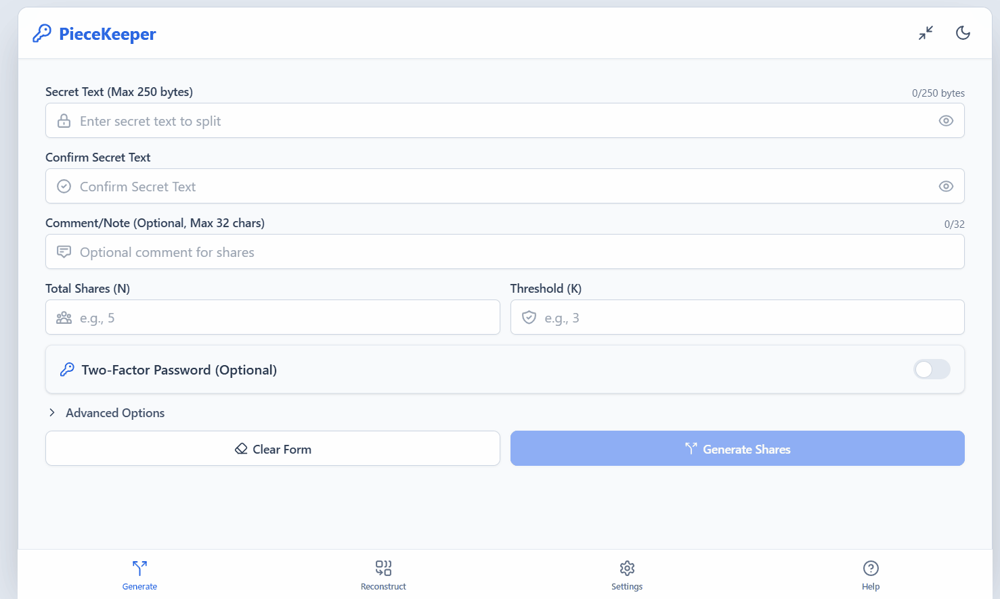

<div align="center">
  
  <p><strong>Distribute secrets. Eliminate single points of failure.</strong></p>
  <p>An offline-first implementation of <a href="https://en.wikipedia.org/wiki/Shamir%27s_secret_sharing">Shamir's Secret Sharing</a>, compiled into a single HTML file.</p>

  
  
  
  
  
  
</div>

PieceKeeper allows you to take a sensitive secret—like a master password, cryptocurrency seed phrase, or private key—and mathematically split it into multiple independent **shares**. You define a threshold (e.g., "any 3 out of 5 shares"), and the secret can only be reconstructed when that minimum number of shares are brought together. Any fewer reveals nothing.

Shares can be distributed as printable **QR codes**, written to **NFC tags**, or saved as plain **text**. An optional two-factor password adds a second layer of protection so that physical possession of shares alone is not sufficient to decode the secret.

The entire application compiles into a **single, self-contained HTML file** with no external dependencies and zero network requests.

<div align="center">
  
  <p><em>Generate shares, scan QR codes & NFC tags, and reconstruct secrets — all offline.</em></p>
</div>

---

## 🌐 Hosted Version

A pre-compiled deployment is available via GitHub Pages:

**[Launch PieceKeeper →](https://midnightlogic.github.io/PieceKeeper/)**

> Once loaded over HTTPS, install PieceKeeper as a **Progressive Web App (PWA)** from the Settings tab. This decouples it from the browser and enables offline access from your device's home screen.

---

## 💡 Common Use Cases

*   **Emergency Break Glass Accounts:** Split a privileged admin or root credential across multiple team leads (e.g., 3-of-5). The account can only be activated when the required threshold of authorised personnel come together — enforcing dual-control without a single point of compromise.

*   **Estate Planning & Inheritance:** Split a crypto wallet seed phrase among family members and a lawyer. Funds can only be accessed when the required threshold of parties come together — no single individual can act alone.

*   **Geographic Distribution:** Split a master backup password and store shares in separate physical locations: a home safe, a bank deposit box, and a secure office. If one location is compromised, the secret remains protected.

*   **Distributed Team Access:** Split a critical server password or API key among 5 executives, requiring at least 3 to agree before it can be unlocked. No single person holds unilateral access.

---

## ✨ Features

*   **Flexible Thresholds (K of N):** Split a secret into up to 64 shares with any threshold you define (e.g., 3-of-5, 4-of-8).
*   **Two-Factor Password Protection:** Optionally encrypt shares with a master password. Reconstruction requires both the physical shares and the password.
*   **QR Code Generation & Scanning:** Generate printable QR codes for each share. Scan them back using the built-in camera scanner—no keyboard input needed.
*   **NFC Tag Support:** Write shares directly to NFC tags and read them back with a simple tap. Ideal for hardware-grade distribution. (Note: NFC features are currently only supported on Chrome for Android).
*   **Print-Ready PDF Layout:** One-click printing with share metadata, QR codes, and clearly formatted instructions.
*   **21 Languages:** Fully internationalized interface covering English, Spanish, French, German, Italian, Dutch, Polish, Portuguese, Russian, Turkish, Arabic, Hindi, Bengali, Thai, Vietnamese, Indonesian, Japanese, Korean, Hebrew, and Chinese (Simplified + Traditional).
*   **Progressive Web App:** Installable on iOS and Android as a standalone application with full offline capability.
*   **Dark Mode, Audio Feedback, Haptic Feedback, RTL Support:** Configurable theme, optional UI sounds, haptic feedback, and right-to-left layout for Arabic and Hebrew.
*   **Desktop Width Toggle:** Switchable between compact app-like layout and wide desktop layout, with preference persistence.
*   **Built-in Diagnostic Suite:** Run internal cryptographic self-tests to verify your device's compatibility before generating shares.

---

## 🔒 Core Philosophy

*   **Single-File, Zero Dependencies:** The build compiles all application logic, cryptographic libraries, stylesheets, translations, and icons into one portable HTML file. Store it on a USB drive, print it to paper, or vault it anywhere.
*   **Offline by Design:** PieceKeeper makes zero network requests. Your data never leaves your device. The application functions identically whether you are connected to the internet or completely air-gapped.
*   **No Secret Persistence:** Secrets and shares are never written to disk, `IndexedDB`, or cookies. Only user preferences (theme, language, layout) are stored in `localStorage`. When you close the tab, all cryptographic material is gone.

---

## 🔐 Cryptography

*   **Shamir's Secret Sharing (SSS):** Generates polynomial shares over a 5-tier prime Galois Field (128-bit to 2048-bit), providing information-theoretic security below the threshold.
    - **Dynamic Prime Selection (default):** Automatically selects the smallest prime that fits the secret, minimising share size and QR code density.
    - **Stealth Mode (advanced):** Forces all shares to the maximum 2048-bit prime with zero-padded payloads, producing uniform-length shares that reveal nothing about the secret's actual size.
*   **Key Derivation Functions:** Six configurable KDF profiles ship with the application:
    - **Argon2id** — Memory-hard, OWASP-recommended. Profiles at 19MB (mobile) and 64MB (default).
    - **scrypt** — Memory-hard legacy alternative at OWASP baseline (N=131072).
    - **PBKDF2** — CPU-bound, FIPS-140 compliant. Configurable from 100k to 2M iterations with SHA-256/SHA-512.
*   **Encryption:** AES-256-GCM authenticated encryption for all password-protected shares.
*   **Tamper-Evident Shares:** Each share is a self-describing Base64 envelope containing schema version, set identifier, timestamp, and N/K parameters.
*   **Content Security Policy:** Production builds inject SHA-256 script hashes into CSP headers, blocking arbitrary code execution without relying on `unsafe-eval`. Frame-ancestors, form-action, and base-uri are locked down.
*   **XSS Protection:** All user-supplied data (comments, share strings, metadata) is escaped via `escapeHtml()` before any HTML rendering.

### Cryptographic Architecture (Deep Dive)

<details>
<summary><strong>Click to expand: Share Binary Format, Prime Fields, Polynomial Arithmetic, and Integrity Checksums</strong></summary>

#### Galois Field & Prime Table

All Shamir arithmetic is performed modulo a prime `p` in GF(p). PieceKeeper uses a **5-tier prime resolution table**, where each prime is the smallest verified prime strictly greater than `2^(B×8)`:

| Tier | Boundary (B) | Prime                | Bit-width | Typical use                    |
|------|:-------------|:---------------------|:----------|:-------------------------------|
| 0    | 16 bytes     | 2¹²⁸ + 51            | 128-bit   | Short passwords (≤16 bytes)    |
| 1    | 32 bytes     | 2²⁵⁶ + 297           | 256-bit   | Standard passwords (≤32 bytes) |
| 2    | 64 bytes     | 2⁵¹² + 75            | 512-bit   | Seed phrases (≤64 bytes)       |
| 3    | 128 bytes    | 2¹⁰²⁴ + 643          | 1024-bit  | Extended secrets (≤128 bytes)  |
| 4    | 256 bytes    | 2²⁰⁴⁸ + 981          | 2048-bit  | Maximum / Stealth mode         |

**Dynamic Prime Selection (default):** The engine selects the smallest tier whose boundary `B` fits the raw payload length (`1 + 1 + secretLen + 4` bytes), minimising share output size and QR code density.

**Stealth Mode (advanced):** Forces Tier 4 (2048-bit) for all shares regardless of secret length. The payload is zero-padded to the full 256-byte boundary, producing uniform-length shares that reveal nothing about the secret's actual size.

#### Secret Payload Construction

Before polynomial evaluation, the raw secret is wrapped in an integrity envelope:

```
[0x01 marker] [1-byte secretLen] [secretBytes...] [4-byte SHA-256 checksum] [0x00 padding...]
```

- **Marker (1 byte):** Fixed `0x01` sentinel for post-reconstruction validation.
- **Length prefix (1 byte):** Encodes the exact byte length of the user's secret, enabling precise extraction after reconstruction.
- **Secret bytes:** UTF-8 encoded user secret (max 250 bytes).
- **Checksum (4 bytes):** Truncated SHA-256 of the original secret bytes. Used during reconstruction to detect corruption or tampered shares.
- **Padding (Stealth only):** Zero bytes to fill to the prime boundary.

This byte array is then converted to a BigInt `S` — the secret term (`a₀`) of the polynomial.

#### Polynomial Evaluation

For a threshold `K`, the engine generates a random polynomial of degree `K-1`:

```
f(x) = a₀ + a₁x + a₂x² + ... + aₖ₋₁xᵏ⁻¹  (mod p)
```

Where `a₀ = S` (the secret) and `a₁...aₖ₋₁` are cryptographically random coefficients in `[1, p-1]` generated via `crypto.getRandomValues()`. Each share `i` is the point `(i, f(i) mod p)`.

#### Lagrange Interpolation (Reconstruction)

Given `K` points `(x₁, y₁) ... (xₖ, yₖ)`, the secret `S = f(0)` is recovered via:

```
S = Σᵢ yᵢ · Lᵢ(0)  (mod p)

Lᵢ(0) = Πⱼ≠ᵢ (0 - xⱼ) / (xᵢ - xⱼ)  (mod p)
```

Division is computed via modular multiplicative inverse using the extended Euclidean algorithm.

#### Share Binary Envelope (Schema v2.0)

Each share is a self-describing binary packet encoded as Base64URL:

```
┌──────────────────── AAD (Authenticated Additional Data) ─────────────────────┐
│ [2B version] [1B flags] [1B kdfSchema] [4B timestamp] [4B familyId] [2B commentLen] [commentBytes...] │
└──────────────────────────────────────────────────────────────────────────────┘
┌──── Payload (encrypted if 2FA enabled, plaintext otherwise) ────┐
│ [1B N] [1B K] [1B X-coordinate] [variable: Y-coordinate bytes]  │
└─────────────────────────────────────────────────────────────────┘
```

**Flags byte bitmask:**
- Bit 0: `isEncrypted` (Two-Factor password applied)
- Bit 1: `isStealth` (Uniform padding active)
- Bits 2–4: `primeIndex` (0–4, selects which prime tier was used)

The AAD metadata is always plaintext (not encrypted) so shares can be inspected without a password. The inner payload (N, K, X, Y) is encrypted via AES-256-GCM when two-factor is enabled.

#### Two-Factor Encryption Pipeline

When a password is provided:

1. **Salt generation:** 16 bytes from `crypto.getRandomValues()`.
2. **Key derivation:** The password is stretched via the user-selected KDF (Argon2id / scrypt / PBKDF2) in a dedicated Web Worker thread.
3. **Encryption:** The inner payload + AAD are sealed with AES-256-GCM. The 12-byte IV is prepended to the ciphertext.
4. **Decryption:** During reconstruction, the same KDF is re-derived from the password + salt, and the GCM tag authenticates both the ciphertext and AAD before releasing the inner coordinates.

#### Memory Safety

After every cryptographic operation, all intermediate byte arrays (`passwordBytes`, `secretBytes`, `checksumBytes`, polynomial coefficients) are zeroed via `.fill(0)`. This minimises the window during which sensitive material exists in JavaScript heap memory.

</details>

---

## 📖 Workflow

#### Splitting a Secret
1. Navigate to the **Generate** tab.
2. Enter your secret text and set a comment (optional).
3. Choose the total number of shares (N) and the reconstruction threshold (K).
4. Optionally enable two-factor password protection.
5. Tap **Generate Shares**. The cryptographic engine runs in a background thread to keep the UI responsive.
6. Distribute the resulting shares: copy as text, print as QR codes, download as CSV, or write to NFC tags.

#### Reconstructing a Secret
1. Navigate to the **Reconstruct** tab.
2. Input shares using any combination of: manual paste, QR code scanning, NFC tag tapping, or file upload.
3. Once the minimum threshold (K) is met, provide the two-factor password if one was used.
4. Tap **Reconstruct** to reveal the original secret.

---

## 📱 Device Support

*   **Desktop:** Chrome, Firefox, Safari, and Edge. Installable as a desktop PWA.
*   **Mobile:** iOS Safari and Android Chrome. Camera and NFC features require HTTPS or localhost.
*   **Offline:** Once installed as a PWA, the application works without any network connection.

---

## 🛠️ Build from Source

PieceKeeper uses Vite with a single-file build plugin to compile everything into one HTML file.

### 1. Clone & Install
```bash
git clone https://github.com/MidnightLogic/PieceKeeper.git
cd PieceKeeper
npm install
```

### 2. Development Server
```bash
npm run dev
```

### 3. Production Build
Compiles all modules, stylesheets, and assets into `dist/index.html`:
```bash
npm run generate-icons
npm run build
```

---

## 🚦 Local HTTPS Testing

To test hardware features (camera, NFC) that require a secure context without deploying to a server:

```bash
npm run build
npm run preview:tunnel
```

This starts a local server and creates a temporary HTTPS tunnel, allowing you to test on mobile devices over your local network.

Note: Because the application is configured for GitHub Pages routing, you must append /PieceKeeper/ to the end of the temporary tunnel URL provided in your terminal (e.g., https://[your-tunnel-url]/PieceKeeper/).


## 📜 License

Apache 2.0 License. See [LICENSE](LICENSE) for details.
